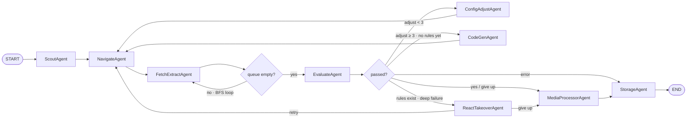

# LangGraph Multi-Agent Crawler

[简体中文](README.zh-CN.md)

[](https://github.com/LingMi1/langgraph-multi-agent-crawler/actions/workflows/ci.yml)
[](LICENSE)
[](pyproject.toml)
[](tests)
[](docs/en/README.md)
[](docs/zh-CN/README.md)

**A multi-agent web harvesting system built from the ground up on LangGraph's Supervisor pattern.** Not a crawler that hands every page to an LLM — a deterministic-first pipeline where 9 specialist agents (scout → navigate → fetch/extract → evaluate → media → store) automate the full lifecycle of a site, and the LLM is an *enhancer, never a dependency*: every node has a fallback that runs without the model.

<details>
<summary><b>Table of Contents</b></summary>

- [Why this exists](#why-this-exists)
- [Screenshots](#screenshots)
- [Architecture](#architecture)
- [Features](#features)
- [Tech Stack](#tech-stack)
- [Quick Start](#quick-start)
- [Project Structure](#project-structure)
- [Testing](#testing)
- [Key Design Decisions](#key-design-decisions)

</details>

## Why this exists

Most "AI crawlers" are thin wrappers that call an LLM on every page — slow, expensive, and they stall the moment the model endpoint hiccups. I wanted to answer the production questions:

- How do you keep a 500-page crawl down to **3 LLM calls**?
- How do you survive an LLM endpoint outage *mid-run* without losing the crawl?
- How do you measure "did this change help" instead of guessing?
- How do you take over autonomously when deterministic extraction fails?

This project is my answer: a supervisor graph with plan-and-execute and a review loop, backed by a run-level circuit breaker, batched post-hoc rescue, budget-triggered working-memory compaction, an offline golden-set evaluation, and 288 unit tests.

## Screenshots

A real crawl of [hnbn666.cn](http://www.hnbn666.cn/) (RuiQiCMS visual-builder template) through the web workbench:

| Step 1 · Enter the target URL — one-click start | Step 2 · Crawl console — SSE live progress + DAG visualization |
|---|---|
|  |  |

## Architecture



**9 orchestrated agents** (`graph/agents.py`, unified `BaseAgent` template method — trace recording, exception isolation, timing):

| Agent | Responsibility | LLM |
|---|---|---|
| ScoutAgent | analyze seed site → site profile + initial plan | no |
| NavigateAgent | extract navigation → fill BFS queue + section list | optional (classify) |
| FetchExtractAgent | fetch + rule-based cleaning + persist (deterministic first) | deep-degrade only |
| EvaluateAgent | quality gate + plan-completion check → adjudicate next step | yes (heuristic veto) |
| ConfigAdjustAgent | apply eval-driven config changes, re-crawl (≤3 times) | no |
| CodeGenAgent | LLM generates site-specific CSS-selector rules | yes |
| ReactTakeoverAgent | ReAct takeover when the deterministic chain fully fails | yes |
| MediaProcessorAgent | image filtering (decor/qr) + externalize + global dedup | no |
| StorageAgent | CSV persist + site-pattern memory write | no |

## Features

### Reliability (LLM as an enhancer, never a dependency)

- **Run-level LLM circuit breaker** (`agents/breaker.py`) — both LLM entry points share one breaker: 3 consecutive exhausted-retry failures fast-fail every later call in the run (callers degrade instead of waiting on timeouts); a single success resets; reset at run start. **The breaker blocks only the LLM, never the crawl.**
- **Batched post-hoc rescue** — the BFS hot path runs at **zero LLM** (selector locate reads a SQLite-persisted cache, heuristic fallback otherwise). Under-par pages go to a rescue queue and are grouped by URL template (path digit → `{N}`), so **one LLM call locates the selector for a whole section**. When the LLM is down, pages are saved degraded rather than dropped.
- **Multi-provider failover + SSE streaming** (`agents/llm_pipeline.py`) — `chat_json`/`chat_stream` switch to `LLM_BACKUP_BASE_URLS` once the primary exhausts retries, all under the same run-level breaker. Streaming output is also exposed as a `/chat/stream` SSE endpoint.
- **Budget-triggered working-memory compaction** (`agents/react.py`) — conversation history is *working memory*; when the estimated token budget is exceeded, keep `system` + recent reasoning frames and fold the rest into one summary: **LLM summarizer first, a rule summarizer as fallback** (compaction never crashes; the event is traced as `event=context_compact`).

### Evaluation (changes become numbers, not feelings)

- **Offline golden-set harness** (`tools/golden_check.py`) — 3 template sites (portal / ecommerce `books.toscrape` / paged list `quotes.toscrape`), P/R/F1 with a conservative `overlap = min(saved, expected)` accounting plus section-recall, `--json` machine-readable output.
- **Task success rate** — end-to-end binary verdict per task: `success = ok and budget_ok`, where **quality assertions and LLM cost both must pass**. A task that is content-perfect but blows the LLM budget is a failure — the acceptance criterion of a production agent.
- **Regression diff in CI** (`tools/compare_runs.py`) — full-metric diff between two golden reports; any primary metric worse → `REGRESSION` (exit 1, CI-gateable), all equal → `SAME`.
- **LLM-as-judge** (`agents/eval.py`) — `judge_agreement` computes Cohen's kappa between human labels and LLM verdicts (calibration tooling, not a runtime score).

### Engineering

- **Three-layer prompt-injection defense** (`agents/safety.py`) — untrusted HTML wrapped with an explicit "data, not instructions" declaration; strict Pydantic output schemas (parse failure → heuristic degrade); conflict veto (LLM says pass but heuristics strongly disagree → downgraded).
- **Compliance & transport safety** (`agents/fetcher.py`) — robots.txt check on by default (stdlib `robotparser`, zero new dependencies, per-domain parser cache, missing/network-failure → allow, blocked URLs marked `blocked_by_robots`); TLS verification on by default (`CRAWLER_TLS_VERIFY` for explicit exemption); self-imposed frequency limiting (human-pace delay + concurrency semaphore).
- **Cross-run site memory** (`memory.py`) — `site_patterns` writes site type / JS-render / template hints after a successful crawl; a second crawl of the same site hits the memory and skips re-reconnaissance (cold → warm start, 100% hit rate measured).
- **Full trace observability** — every agent's input digest / decision / output / duration lands in JSONL (`output/<netloc>/traces/`), events cover start/end/error/decision/plan/review/memory_hit/store.
- **Lightweight RAG** (`agents/semdedup.py` + `agents/vector_retriever.py`) — character-level n-gram Jaccard near-duplicate detection (no tokenizer/vector DB), plus a zero-dependency TF-IDF cosine retriever over harvested pages with two-stage reranking (pseudo-relevance-feedback query expansion + score fusion), scored with Recall@k / NDCG@k.
- **MCP integration** (`tools/mcp_server.py` + `tools/mcp_client.py`) — action/analysis tools exposed as MCP stdio tools (protocol 2025-11-25), single-source executors shared with the in-process function-calling path; fail-closed error channel.
- **FastAPI service** (`api/server.py`) — `POST /crawl` (202 / 409 single-slot busy / 429 throttled), `GET /tasks/{id}`, `GET /tasks/{id}/results`; X-API-Key auth, per-client submit throttling, Dockerfile. The service layer holds **zero business logic** — CLI, desktop GUI, and REST share one `run_langgraph_crawler` entry (three shells, one core).
- **Lightweight distributed scheduler** (`distributed/`) — stdlib SQLite task queue + multiprocessing workers, zero new dependencies: `BEGIN IMMEDIATE` atomic claim, lease + heartbeat + crash recovery, attempts-bounded retry. Shard dimension is the *site* (each worker runs one site's full workflow). Batch-ran 3 real sites with 2 workers to `{'done': 3}`, `attempts=1` each — exactly-once.

## Tech Stack

| Layer | Technology |
|---|---|
| Runtime | Python 3.11 · asyncio (semaphore throttling) |
| Orchestration | LangGraph (StateGraph + TypedDict State + Reducers) |
| LLM | langchain-openai (DeepSeek-compatible endpoint) + multi-provider failover |
| Fetch | httpx / requests · Playwright (JS-render fallback) · stealth header set |
| Parse & clean | BeautifulSoup4 · trafilatura · custom rule engine |
| Data | Pydantic v2 · SQLite (dedup / HTML cache / site memory) · CSV / files |
| Service | FastAPI · SSE · Docker |
| Quality | pytest (288) · JSONL traces · golden-set eval · LLM-as-judge · CI |

## Quick Start

```bash
pip install -r requirements.txt
playwright install chromium          # only for JS-rendered template sites

# CLI crawl
python -c "import asyncio; from graph.workflow import run_crawler; asyncio.run(run_crawler('https://example.com', max_steps=3000))"

# Unit tests
python -m pytest tests -q            # 288 passed

# MCP stdio round-trip (handshake → tool discovery → call_tool → error channel)
python tools/mcp_client.py https://example.com/

# REST service (submit / progress / results + API key + throttling)
uvicorn api.server:app --host 0.0.0.0 --port 8000
curl -X POST localhost:8000/crawl -H "Content-Type: application/json" \
     -d '{"url": "https://example.com/", "concurrency": 5}'

# Lightweight distributed scheduler (SQLite queue + multiprocessing workers)
python distributed/scheduler.py enqueue urls.txt
python distributed/scheduler.py run-workers --workers 2
python distributed/scheduler.py status

# Offline static check (self-built stdlib checker; ruff cross-verifies in CI)
python tools/static_check.py         # 64 files / 0 issues

# Golden offline eval (P/R/F1 + section recall, --json machine-readable)
python tools/golden_check.py --offline --json

# Project metrics report (offline: golden metrics + real-site stats + eval-loop traces)
python tools/gen_metrics_report.py   # → reports/metrics_report.{md,json}

# Regression diff (full-metric, REGRESSION → exit 1)
python tools/compare_runs.py baseline.json current.json

# Lightweight RAG demo (index harvested HTML + semantic query)
python tools/rag_demo.py hnbn666
```

Desktop GUI (tkinter): `python site_crawler_gui.py` (batch URL import from TXT + platform/API-key config + per-site crawl).

## Project Structure

```
├── agents/          # capability agents + safety layer + tool registry + budget
│                    #   + react (FC loop) + semdedup + vector_retriever + eval
├── graph/           # orchestration: workflow (Supervisor) / agents (9) / nodes / state
│                    #   + react_takeover (deep-degradation ReAct takeover)
├── tests/           # 288 unit tests (safety / plan / tools / ReAct / budgeting /
│                    #   dedup / RAG / eval metrics / FC eval path / graph smoke /
│                    #   golden loop / regression / takeover / breaker+rescue /
│                    #   MCP / API / distributed queue)
├── api/             # FastAPI service (server.py: submit/progress/results)
├── distributed/     # SQLite task queue + multiprocessing scheduler
├── tools/           # golden_check / compare_runs / static_check / check_links /
│                    #   rag_demo / analyze_trace / mcp_server + mcp_client /
│                    #   gen_metrics_report
├── reports/         # metrics_report.{md,json} — offline quantified evidence
├── memory.py        # SQLite long-term memory (visited_urls / site_patterns)
├── schemas.py       # Pydantic models + logging
├── .github/         # CI (multi-version Python: pytest + static check + golden)
└── main.py          # CLI entry
```

## Testing

**288 unit tests, all green.** Every subsystem has dedicated coverage: safety (injection defense), plan-and-execute, BaseAgent template, tool layer + tool-arg sanitization, ReAct loop, token budgeting, compaction (8 cases: trigger boundary / system+recent-frame retention / summary fallback / loop convergence), Jaccard dedup, RAG retrieval metrics + two-stage reranking, trace-analysis (token/cost + agent success rate), eval metrics, FC evaluation path, graph assembly smoke, golden regression loop, deep-degradation takeover, circuit breaker + batched rescue, MCP tool layer, API service layer (incl. SSE), and the distributed queue with multiprocessing consumption.

```
python -m pytest tests -q            # 288 passed
python tools/static_check.py         # 64 files / 0 issues (self-built checker, ruff-verified in CI)
python tools/check_links.py          # markdown relative links (screenshots / docs)
```

The CI pipeline (`.github/workflows/ci.yml`) runs pytest + coverage, the double static check, golden verification, and (advisory) mypy on every push.

## Key Design Decisions

### 1. Deterministic first — the LLM is an enhancer, not a dependency

Every node's default action runs without the model: site-type rules, link density, body length, MD5 dedup, Jaccard near-dup. The LLM only enters at judgment points (evaluate, rule generation, nav classification, deep-degrade) under a semaphore. Each LLM failure degrades back to the deterministic path — `selector → code heuristics`, `classify → rule-based nav`, `clean → original body`. **Trade-off:** deterministic rules never cover the long tail (WYSIWYG builders, weird templates) — accepted because the deep-degradation ReAct agent covers exactly that tail.

### 2. Budget-triggered compaction — correctness lives in structured state, not the summary

The conversation history inside the FC loop is working memory; correct decisions live in structured `CrawlerState`, so folding old reasoning frames into one summary loses only process frames, never state. When the token budget is exceeded: keep `system` + recent frames, fold the rest into one summary — LLM summarizer first, a rule summarizer (keeps tool names + success/failure truthfully) as fallback. **Trade-off:** the summary drops intermediate reasoning — accepted because state, not prose, carries correctness; the event is traced for audit.

### 3. Circuit breaker with no half-open — a measured, honest boundary

Threshold of 3 consecutive exhausted-retry failures, reset on a single success, reset at run start (so GUI multi-site runs don't pollute each other). No half-open state and no reset on a timer — documented as a deliberate simplification ("this is not an industrial-grade breaker"). **Trade-off:** after a trip, the LLM stays down for the rest of the run — accepted because callers degrade to deterministic paths, and the crawl (not the LLM) is the product.

### 4. Batched post-hoc rescue over per-page LLM

An earlier design located the content selector per page on the BFS hot path — when the internal endpoint was half-dead, single pages timed out 30–60s and stalled the whole site overnight. Fix: zero-LLM hot path (persisted selector cache) + a rescue queue grouped by URL template, **one LLM call per section**. **Trade-off:** rescue is deferred to the evaluate stage instead of being immediate — accepted because content already paid the fetch cost and is never dropped, even when the LLM is fully down (degraded save + status tags).

### 5. robots.txt and TLS verify default-on

Compliance and transport security default to safe: robots.txt checked before every fetch (stdlib `robotparser`, per-domain parser cache, missing/failure → allow), TLS verification on. **Trade-off:** a strict robots.txt can legitimately block a crawl, and self-signed intranet certs break fetching — accepted with explicit escape hatches (`CRAWLER_RESPECT_ROBOTS=false`, `CRAWLER_TLS_VERIFY=false`): default safe, explicit exception.

### 6. SQLite task queue over Redis/Celery

The workload is tens of sites; the bottleneck is site I/O, not queue throughput. A `BEGIN IMMEDIATE` write lock is enough mutual exclusion for N workers, and SQLite means zero new infrastructure and zero ops. **Trade-off:** single-node horizontal scale only — accepted because the shard dimension is the site (each worker runs one site's whole workflow), and cross-process LangGraph state is architecturally unsupported anyway.

### 7. Exactly-once via atomic claim + lease

Claiming is atomic (`BEGIN IMMEDIATE`), so N workers never double-grab a task; leases expire and stale tasks are requeued (at-least-once), and attempts are bounded (fail → retry until cap → terminal `failed`). Measured: 3 sites × 2 workers → `{'done': 3}`, `attempts=1` each. **Trade-off:** a lease is a timeout, not a lock — a crashed worker's task is redone, which is the accepted at-least-once semantic dressed in exactly-once measurement.

### 8. MCP and the in-process FC loop share one executor

`FunctionCallingLoop` is the in-process LLM→tool protocol; MCP is the cross-process/cross-vendor standard (JSON-RPC over stdio). Both call the **same** executors (`fetch_page` / `apply_config` / `quality_judge`) — one implementation serves three paths (in-process FC, ReAct takeover, MCP client). **Trade-off:** the MCP layer adds protocol overhead — accepted because composability with any MCP client (Claude Desktop, Cursor, custom agents) beats micro-optimizing the boundary.

---

*Measured results (offline-reproducible via `python tools/gen_metrics_report.py`): 8 real sites / 236 pages harvested; golden offline eval on hnbn666 (RuiQiCMS visual-builder template) = PASS with P/R/F1 0.60/1.00/0.75; 288 tests all green. Development milestones (CHANGELOG): a full crawl of zztzmjg.com went from stalled overnight at 86 pages to 85 seconds with 3 LLM calls via the circuit breaker + batched rescue; evaluation loops fired 12 config adjustments across 4 runs (saved 1→98 on xnjzgc.cn); the site-memory warm start hit 100%; the distributed scheduler ran 3 sites × 2 workers exactly-once.*
