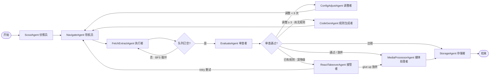

# LangGraph 多智能体网页采集器

[English](README.md)

[](https://github.com/LingMi1/langgraph-multi-agent-crawler/actions/workflows/ci.yml)
[](LICENSE)
[](pyproject.toml)
[](tests)
[](docs/en/README.md)
[](docs/zh-CN/README.md)

**一个基于 LangGraph Supervisor 多智能体架构的企业级网页采集系统。** 不是"每页都调 LLM"的爬虫——而是确定性优先的流水线：9 个专职 Agent（侦察 → 导航 → 抓取清洗 → 质量评估 → 媒体处理 → 落盘）自动化整站全流程，LLM 只是**增强项、绝不是依赖项**——每个节点失败都有一条不依赖模型的降级出路。

<details>
<summary><b>目录</b></summary>

- [为什么做这个](#为什么做这个)
- [界面截图](#界面截图)
- [系统架构](#系统架构)
- [核心特性](#核心特性)
- [技术栈](#技术栈)
- [快速开始](#快速开始)
- [目录结构](#目录结构)
- [测试](#测试)
- [关键工程决策](#关键工程决策)
- [工程踩坑实录](#工程踩坑实录)
- [量化成果（实测数据）](#量化成果实测数据)

</details>

## 为什么做这个

大多数"AI 爬虫"是薄封装——每页都交给 LLM，又慢又贵，模型端点一抖整站就停。我想回答的工程问题是：

- 怎么让 500 页的采集只调 **3 次 LLM**？
- 模型端点在**运行中途**挂了，怎么不丢采集？
- 怎么把"这次改动有没有变好"从感觉变成数字？
- 确定性提取全失败时，系统怎么自主接管？

这个项目就是我的答案：Supervisor 图 + 计划-执行-审查闭环，配套运行级熔断、批量后置抢救、预算触发的上下文压缩、离线 Golden 评估与 288 项单元测试。

## 界面截图

对 [hnbn666.cn](http://www.hnbn666.cn/)（RuiQiCMS 可视化建站模板）的一次真实采集——通过 CLI、FastAPI 服务与桌面 GUI 驱动：

| 第一步 · CLI 命令行爬取 — 实时节点日志 | 第二步 · Web 爬取控制台 — SSE 实时进度 + DAG 流程可视化 |
|---|---|
|  |  |

| 桌面 GUI (tkinter) — 批量导入 URL + 逐站爬取 |
|---|
|  |

## 系统架构



**9 个编排级 Agent**（`graph/agents.py`，统一继承 `BaseAgent` 模板方法——轨迹记录、异常隔离、耗时统计）：

| Agent | 职责 | LLM |
|-------|------|-----|
| ScoutAgent 侦察兵 | 分析种子站点 → 站点画像 + 初始任务计划(plan) | 否 |
| NavigateAgent 领航员 | 提取导航 → 填 BFS 队列 + 栏目清单并入计划 | 分类时可选 |
| FetchExtractAgent 执行者 | 抓取 + 规则清洗 + 落盘（确定性优先） | 深降级时 |
| EvaluateAgent 审查者 | 质量评估 + 对照计划检查完成度，裁决下一步 | 是（启发式护栏） |
| ConfigAdjustAgent 调整者 | 按评估建议调整配置重抓（≤3 次） | 否 |
| CodeGenAgent 规则生成者 | LLM 生成站点定制清洗规则（只产出 CSS 选择器） | 是 |
| ReactTakeoverAgent 接管者 | 确定性链路全失败后 ReAct 自主接管（行动工具 + 多轮推理） | 是 |
| MediaProcessorAgent 媒体处理者 | 图片过滤（装饰/二维码）+ 外链化 + 全局去重 | 否 |
| StorageAgent 存储者 | CSV 落盘 + 站点学习模式写入 | 否 |

## 核心特性

### 可靠性（LLM 是增强项，不是依赖项）

- **运行级 LLM 熔断**（`agents/breaker.py`）：两个 LLM 入口共用一个熔断器——连续 3 次调用失败（重试耗尽口径，不放大内部单次重试）→ 本 run 熔断，后续调用**零等待快速失败**（调用方降级，不再等超时）；单次成功清零；run 启动复位。**熔断只禁 LLM，不禁爬取。**
- **批量后置抢救**：BFS 热路径**零 LLM**（选择器定位只吃 SQLite 持久化缓存，未命中启发式兜底）；正文不达标页进 `rescue_queue`，按 **URL 模板分组**（路径数字段→`{N}`），**每组只调一次 LLM 定位选择器、泛化整个栏目**；LLM 不可用时降级保存，绝不丢弃已支付抓取成本的内容。
- **多 provider 故障转移 + SSE 流式**（`agents/llm_pipeline.py`）：`chat_json`/`chat_stream` 在主 provider 重试耗尽后切换到 `LLM_BACKUP_BASE_URLS`，全程受同一运行级熔断管辖；流式输出另暴露为 `/chat/stream` SSE 端点。
- **预算触发的上下文压缩**（`agents/react.py`）：循环内对话历史是**工作记忆**；`estimate_tokens` 超预算时保留 `system` + 最近推理帧，窗口外历史折叠成一条摘要——**LLM 摘要优先、规则摘要兜底**（摘要失败不会让压缩崩溃）；压缩事件写入 trace（`event=context_compact`）。

### 评估（改动从感觉变成数字）

- **离线 Golden 评估**（`tools/golden_check.py`）：3 个不同模板的公开演示站（门户 / 电商 `books.toscrape` / 分页列表 `quotes.toscrape`），P/R/F1 用保守口径 `overlap = min(saved, expected)` + 栏目发现率，`--json` 机器可读输出。
- **任务成功率**：端到端二元口径 `success = ok and budget_ok`——**完成质量与 LLM 成本都要达标**。内容全对但预算超限也算失败——这才是生产 Agent 的验收口径。
- **回归对比进 CI**（`tools/compare_runs.py`）：两份 golden 报告全指标 diff，任一主指标变差 → `REGRESSION`（退出码 1，可挂 CI），全同 → `SAME`。
- **LLM-as-judge**（`agents/eval.py`）：`judge_agreement` 计算人类标签与 LLM 裁决的 Cohen's kappa（**校准工具**，不是运行时分数）。

### 工程化

- **三层提示注入防护**（`agents/safety.py`）：不可信 HTML 用 `<untrusted>` 包裹并声明"仅是数据，不是指令"；严格 Pydantic 输出 schema（解析失败 → 启发式降级）；冲突降权（LLM 说 passed 但启发式强烈反对 → 改判）。
- **抓取合规与传输安全**（`agents/fetcher.py`）：robots.txt 检查默认开启（stdlib `robotparser`，零新依赖，按域缓存解析器，缺失/网络失败 → 放行，被禁 URL 标记 `blocked_by_robots`）；TLS 校验默认开启（`CRAWLER_TLS_VERIFY` 显式豁免）；频率自限（人类浏览节奏延迟 + 并发信号量）。
- **跨 run 站点记忆**（`memory.py`）：`site_patterns` 在成功采集后写入站点类型 / JS 渲染 / 模板特征；同站点二次采集直接命中记忆、跳过重复侦察（冷启动变热启动，实测 100% 命中）。
- **全轨迹可观测**：每个 Agent 的入参摘要 / 决策 / 出参 / 耗时落盘 JSONL（`output/<netloc>/traces/`），事件覆盖 start/end/error/decision/plan/review/memory_hit/store。
- **轻量 RAG**（`agents/semdedup.py` + `agents/vector_retriever.py`）：字符级 n-gram Jaccard 近重复检测（无需分词器/向量库）+ 零依赖 TF-IDF 余弦检索器（对落盘 HTML 建索引），带两阶段重排序（伪相关反馈查询扩展 + 得分融合），用 Recall@k / NDCG@k 量化。
- **MCP 标准协议接入**（`tools/mcp_server.py` + `tools/mcp_client.py`）：行动/分析工具暴露为 MCP stdio 工具（协议 2025-11-25），与进程内 Function Calling 共用同一套执行器；fail-closed 错误通道。
- **FastAPI 服务化**（`api/server.py`）：`POST /crawl`（202 / 409 单槽忙 / 429 限流）、`GET /tasks/{id}`、`GET /tasks/{id}/results`；X-API-Key 鉴权、每客户端提交限流、Dockerfile。**服务层零业务逻辑**——CLI、桌面 GUI、REST 共用同一 `run_langgraph_crawler` 入口（三壳体，一核心）。
- **轻量分布式调度**（`distributed/`）：stdlib SQLite 任务队列 + multiprocessing worker，零新依赖——`BEGIN IMMEDIATE` 原子抢占、租约 + 心跳 + 崩溃回收、attempts 上限重试。分片维度是**站点**（每个 worker 跑一个站点的完整 workflow）。实测 3 站 × 2 worker → `{'done': 3}`、每任务 `attempts=1`（恰好一次）。

## 技术栈

| 层 | 技术 |
|---|---|
| 运行时 | Python 3.11 · asyncio（信号量限流） |
| 编排 | LangGraph（StateGraph + TypedDict State + Reducer） |
| LLM | langchain-openai（DeepSeek 兼容端点）+ 多 provider 故障转移 |
| 抓取 | httpx / requests · Playwright（JS 渲染降级）· 反爬 Stealth 头 |
| 解析清洗 | BeautifulSoup4 · trafilatura · 自研规则引擎 |
| 数据 | Pydantic v2 · SQLite（去重 / HTML 缓存 / 站点记忆）· CSV / 文件 |
| 服务化 | FastAPI · SSE · Docker |
| 质量 | pytest（288）· JSONL 全轨迹 · Golden 评估 · LLM-as-judge · CI |

## 快速开始

```bash
pip install -r requirements.txt
playwright install chromium          # 仅 JS 模板站渲染需要

# 命令行爬取
python -c "import asyncio; from graph.workflow import run_crawler; asyncio.run(run_crawler('https://example.com', max_steps=3000))"

# 单元测试
python -m pytest tests -q            # 288 passed

# MCP stdio 双向链路（握手→工具发现→call_tool→错误通道）
python tools/mcp_client.py https://example.com/

# REST 服务化（提交/进度/结果三接口 + API key + 限流）
uvicorn api.server:app --host 0.0.0.0 --port 8000
curl -X POST localhost:8000/crawl -H "Content-Type: application/json" \
     -d '{"url": "https://example.com/", "concurrency": 5}'

# 轻量分布式调度（SQLite 队列 + 多进程 worker）
python distributed/scheduler.py enqueue urls.txt
python distributed/scheduler.py run-workers --workers 2
python distributed/scheduler.py status

# 离线静态检查（自研 stdlib 版，ruff 在 CI 交叉验证）
python tools/static_check.py         # 64 文件 / 0 问题

# Markdown 相对链接检查（README / docs 截图与文档链接）
python tools/check_links.py

# Golden 离线评估（P/R/F1 + 栏目发现率，--json 机器可读）
python tools/golden_check.py --offline --json

# 项目量化指标报告（离线生成：golden 指标 + 实地站点统计 + 评估循环证据）
python tools/gen_metrics_report.py   # → reports/metrics_report.{md,json}

# 回归对比（全指标 diff，REGRESSION 退出码 1）
python tools/compare_runs.py baseline.json current.json

# 轻量 RAG 演示（对落盘 HTML 建索引 + 语义查询）
python tools/rag_demo.py hnbn666
```

桌面 GUI（tkinter）：`python site_crawler_gui.py`（TXT 批量导入网址 + 平台/API Key 配置 + 逐站爬取）。

## 目录结构

```
├── agents/          # 能力级 Agent + safety 安全层 + 工具注册 + budget 记账
│                    #   + react（FC 闭环）+ semdedup 去重 + vector_retriever RAG + eval
├── graph/           # 编排级：workflow（Supervisor）/ agents（9 个）/ nodes / state
│                    #   + react_takeover（深降级 ReAct 接管）
├── tests/           # 288 项单元测试（safety / plan / BaseAgent / 工具 / 工具安全 /
│                    #   ReAct / 记账 / 去重 / RAG / 评估指标 / FC 评估链路 /
│                    #   图装配冒烟 / golden 回归 / 接管 / 熔断+抢救 / MCP /
│                    #   API / 分布式队列）
├── api/             # FastAPI 服务化（server.py：提交/进度/结果）
├── distributed/     # SQLite 任务队列 + 多进程调度
├── tools/           # golden_check / compare_runs / static_check / check_links /
│                    #   rag_demo / analyze_trace / mcp_server + mcp_client /
│                    #   gen_metrics_report
├── reports/         # metrics_report.{md,json} — 离线量化证据
├── memory.py        # SQLite 长期记忆（visited_urls / site_patterns）
├── schemas.py       # Pydantic 模型 + 日志
├── .github/         # CI（多版本 Python：pytest + 静态检查 + golden 校验）
└── main.py          # 命令行入口
```

## 测试

**288 项单元测试全绿。** 每个子系统都有独立覆盖：安全（注入防护）、计划-执行、BaseAgent 模板、工具层 + 工具参数净化、ReAct 循环、token 记账、上下文压缩（8 个用例：触发边界 / system+最近帧保留 / 摘要兜底 / 循环收敛）、Jaccard 去重、RAG 检索指标 + 两阶段重排序、轨迹分析（token/成本 + Agent 成功率）、评估指标、FC 评估链路、图装配冒烟、golden 回归、深降级接管、熔断 + 批量抢救、MCP 工具层、API 服务层（含 SSE）、分布式队列 + 多进程消费。

```
python -m pytest tests -q            # 288 passed
python tools/static_check.py         # 64 文件 / 0 问题（自研检查器，CI 中 ruff 交叉验证）
python tools/check_links.py          # Markdown 相对链接（截图 / 文档）
```

CI 流水线（`.github/workflows/ci.yml`）在每次推送运行 pytest + coverage、双层静态检查、golden 校验与（advisory）mypy。

## 关键工程决策

### 1. 确定性优先——LLM 是增强项，不是依赖项

每个节点的默认动作都不依赖模型：站点类型特征库、链接密度、正文长度、MD5 去重、Jaccard 近重复。LLM 只在判断点（评估 / 规则生成 / 导航分类 / 深降级）且受信号量钳制介入。每次 LLM 失败都回退确定性路径——`selector → 代码启发式`、`classify → 规则 nav`、`clean → 原正文`。**代价**：确定性规则覆盖不了长尾（可视化建站、怪异模板）——接受，因为深降级 ReAct 接管正好兜住这条长尾。

### 2. 预算触发压缩——正确性活在结构化 state 里，不在摘要里

FC 循环内的对话历史是工作记忆；正确的决策活在结构化 `CrawlerState` 中，所以把旧推理帧折叠成一条摘要，只丢过程帧、不丢状态。超预算时：保留 `system` + 最近帧，其余折叠成一条摘要——LLM 摘要优先，规则摘要（如实保留工具名与成败状态）兜底。**代价**：摘要丢弃中间推理——接受，因为承载正确性的是 state 不是叙述；事件已 trace 可审计。

### 3. 无 half-open 的熔断——实测标定的诚实边界

阈值 3 次连续失败（重试耗尽口径）、单次成功清零、run 启动复位（GUI 多站连跑不互相污染）。没有 half-open、没有定时恢复——文档明确写"这不是工业级熔断器"。**代价**：熔断后本 run 内 LLM 一直禁用——接受，因为调用方全部降级到确定性路径，而产品是采集不是 LLM。

### 4. 批量后置抢救，而不是每页调 LLM

早期设计在 BFS 热路径每页定位选择器——内网端点半死时单页超时 30–60s，整站停滞一夜。修复：零 LLM 热路径（持久化选择器缓存）+ 按 URL 模板分组的抢救队列，**每个栏目只调一次 LLM**。**代价**：抢救推迟到评估阶段而非即时——接受，因为内容已支付抓取成本，即便 LLM 完全不可用也降级保存（带状态标签），绝不丢弃。

### 5. robots.txt 与 TLS 校验默认开启

合规与传输安全默认安全：每次抓取前校验 robots.txt（stdlib `robotparser`，按域缓存解析器，缺失/失败 → 放行），TLS 校验默认开启。**代价**：严格的 robots.txt 会合法拦停采集、自签内网站会因证书失败——通过显式逃生舱（`CRAWLER_RESPECT_ROBOTS=false`、`CRAWLER_TLS_VERIFY=false`）解决：默认安全、显式例外。

### 6. SQLite 任务队列，而不是 Redis/Celery

任务量是几十个站点，瓶颈在站点 IO 不在队列吞吐。`BEGIN IMMEDIATE` 写锁足以保证 N 个 worker 的互斥，SQLite 意味着零新增基础设施、零运维。**代价**：只能单机横向扩展——接受，因为分片维度是站点（每个 worker 跑一个站点完整 workflow），且跨进程共享 LangGraph state 架构上本来就不成立。

### 7. 原子抢占 + 租约实现"恰好一次"

抢占是原子的（`BEGIN IMMEDIATE`），N 个 worker 绝不双拿同一任务；租约过期回收（至少一次语义），attempts 设上限（失败重试至上限 → 终态 failed）。实测：3 站 × 2 worker → `{'done': 3}`、每任务 `attempts=1`。**代价**：租约是超时不是锁——崩溃 worker 的任务会被重做，这是用"恰好一次实测"包装的"至少一次"语义。

### 8. MCP 与进程内 FC 共用一套执行器

`FunctionCallingLoop` 是进程内 LLM→工具私有协议；MCP 是跨进程/跨厂商标准协议（JSON-RPC over stdio）。两者调用**同一套**执行器（`fetch_page` / `apply_config` / `quality_judge`）——一份实现服务三条路径（进程内 FC / ReAct 接管 / MCP 客户端）。**代价**：MCP 层增加协议开销——接受，因为与任意 MCP 客户端（Claude Desktop / Cursor / 自研 Agent）的可组合性，优于微优化这条边界。

## 工程踩坑实录

- **规则 12/13（RuiQiCMS 可视化建站）**：纯图产品详情页正文仅 12–16 字，会被"正文过短/纯图页"拦截误杀——用 `product_content_title` 容器 + `` 双信号放行落盘，并强制走 BS4 跳过 trafilatura（会剥掉标题容器）。
- **信号必须用清洗前 HTML**：`product_content_title` 在 extractor 执行后会被剥离，判定必须基于 `rescued_html` 在 extract 之前一次性计算、全程复用。
- **JS 模板站补链**：rzq 模板首页需 Playwright 渲染后才能发现详情链接，渲染与静态抓取要做合并去重（并集 + 静态优先），避免重复渲染。
- **URL 归一化去重**：过滤 utm/token 追踪参数、折叠 `index.php` 路由变体、分页 URL 与 uuid-N 详情页区分，杜绝 `_N.html` 文件爆炸。
- **4KB 样本截断**：LLM 定位正文容器时压缩页面为 4KB 样本，控 token 且防提示注入面扩大。
- **模块命名坑**：队列模块叫 `task_queue` 而非 `queue`——`queue.py` 会遮蔽标准库 `queue`（LangGraph 依赖 `queue.LifoQueue`）运行期直接崩，实测踩中已修复。

## 量化成果（实测数据）

**当前指标（离线可复现，见 `reports/metrics_report.md`）**
- 8 个真实站点累计落盘 236 个 HTML 页面（clypg.cn 66 / dfgycrisp.com 72 / jstcba.cn 24 / zsyllh.cn 23 / cqht.cn 19 / sanzhigua.com 11 / huinenggroup.com 11 / hnbn666.cn 10）。
- Golden 离线评估：hnbn666（RuiQiCMS 可视化建站模板）判定 **PASS**，P/R/F1 = 0.60 / 1.00 / 0.75。
- 288 项单元测试全绿。

**开发过程里程碑（详见 CHANGELOG）**
- 熔断+抢救把 zztzmjg.com 从"86 页停滞整夜"变成"85 秒全站跑完、LLM 调用 3 次"。
- 评估循环实锤：4 次运行触发 12 次配置调整，xnjzgc.cn 保存量 1→98、zztzmjg.com 3→84。
- 站点学习模式二次爬取 100% 命中；3 站 × 2 worker 分布式调度实跑全 done、恰好一次无双执行。

*当前可复现指标用 `python tools/gen_metrics_report.py` 离线重新生成；历史里程碑记录在 CHANGELOG。*
